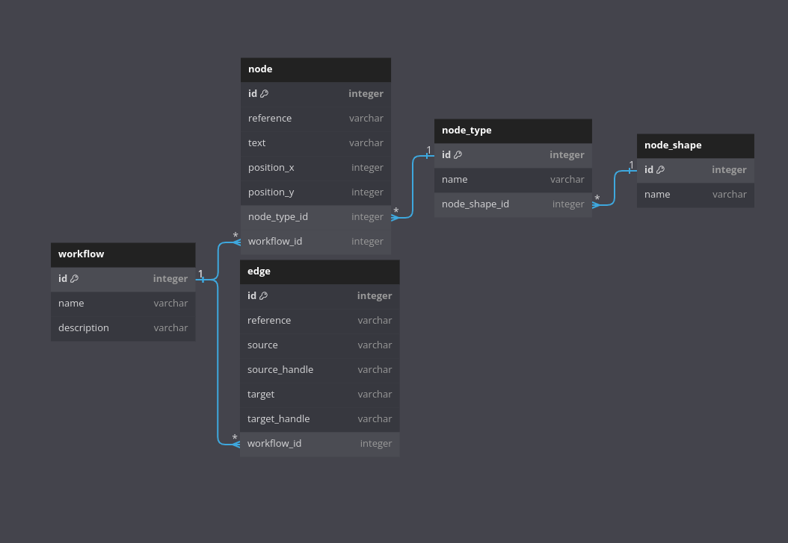

# Workflow Demo - Versión 1.0
## Installation

To use this project, follow these installation steps:

1. Clone the repository to your local machine:

   ```bash
   git clone https://github.com/AndresJoaquinNino/workflow-demo.git
   cd workflow-demo
    ```
2. Installation of dependencies within the folder: **api**
    ```bash
   cd ./api
   npm run install
    ```
3. Installation of dependencies within the folder: **client**
    ```bash
   cd ./client
   npm run install
    ```
## Execution in a Development Environment

**Make sure you have completed the installation.**

Copy a new **.env** file, you can create one based on the existing **.env.example** and adjust it to your preferences.

```bash
cp .env.example .env
```

### API

1. Inside the **api** folder, you should configure the database by running:

    ```bash
    npm run migration:run
    npm run seed:run
    ```
2. To start the local backend server, within the **api** folder, run:

    ```bash
    npm run start:dev
    ```

### Client

1. To start the local frontend server, you'll run it inside the **client** folder.

    ```bash
    npm run start
    ```
2. Open your web browser and visit http://localhost:5179. Verify that the port matches the one used in the **.env** file to see the application in action.

## Database Model


